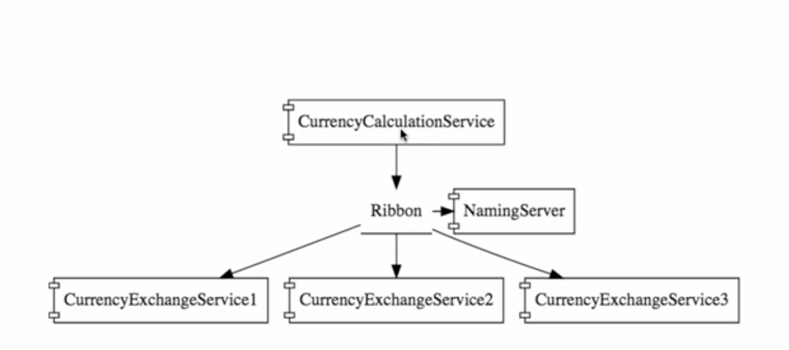

# Spring microservices

1. **Spring boot** - running the application
2. **Spring cloud** - configuration server
3. **Netflix ribbon** - client side load distribution
4. **Feign rest client** - rest client to invoke spring rest service with ease
5. **eureka server** - naming server for service discovery

* **Currency calculation service** - service which convert one currency into another.
* **Currency exchange service** - service which returns exchange rate from in memory H2 database. multiple instances are running for this service to handle load.
* **Spring cloud config server** - spring cloud config server to store all configuration for all applications with multiple environments (profiles).
* **Netflix eureka naming server** - service discovery naming server based on netflix eureka.
* **Limit service** - service to fetch some environment based configuration from spring cloud config server.