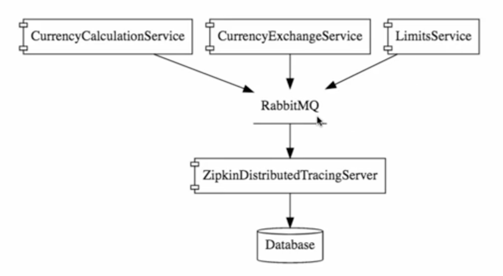
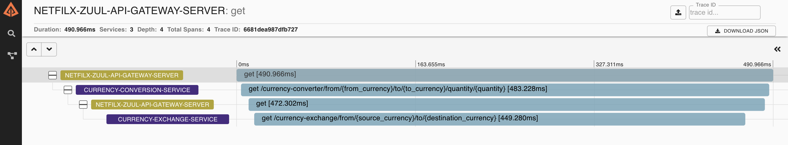
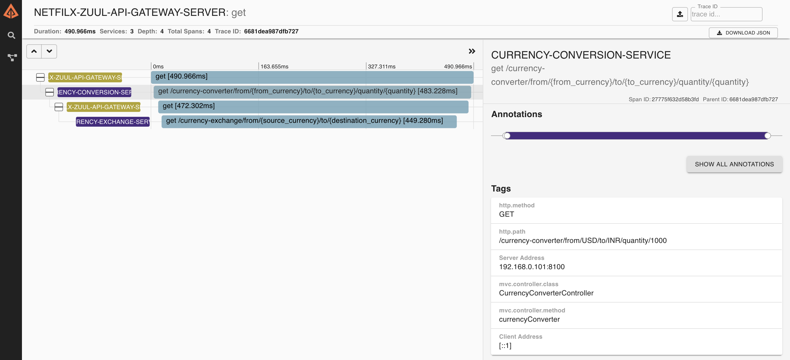
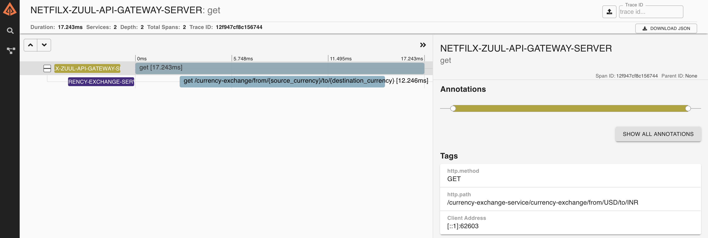
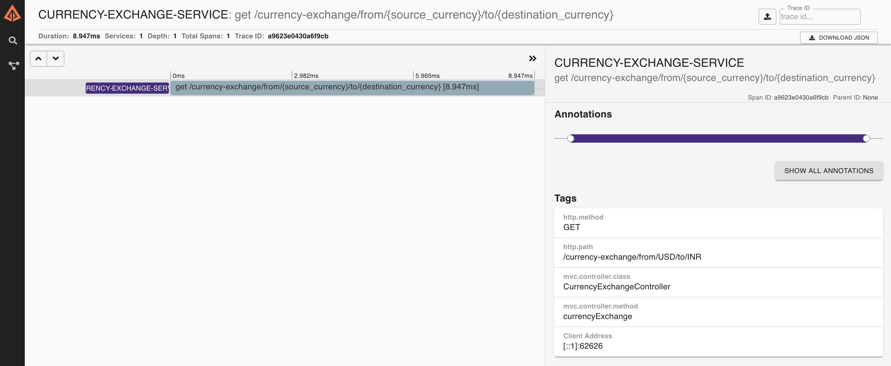

# Spring microservices

1. **Spring boot** - running the application
2. **Spring cloud** - configuration server
3. **Netflix ribbon** - client side load distribution
4. **Feign rest client** - rest client to invoke spring rest service with ease
5. **eureka server** - naming server for service discovery
5. **Zuul API gateway server** - api gateway server to reroute all request via this server instead of directly making call.zuul also supports load distribution.
6. **Spring sleuth**  - distributed tracing library to assign trace ID to each request
6. **Zipkin**  - distributed tracing system. It helps gather timing data needed to troubleshoot latency problems in service architectures.


* **Currency calculation service** - service which convert one currency into another.
* **Currency exchange service** - service which returns exchange rate from in memory H2 database. multiple instances are running for this service to handle load.
* **Spring cloud config server** - spring cloud config server to store all configuration for all applications with multiple environments (profiles).
* **Netflix eureka naming server** - service discovery naming server based on netflix eureka.
* **Limit service** - service to fetch some environment based configuration from spring cloud config server.

---

# Distributed tracing with Zipkin, rabbitMQ, Spring Sleuth

1. download, install  and run rabbitMQ from `https://www.rabbitmq.com/install-homebrew.html`
2. download zipkin from java source
    ```bash
    curl -sSL https://zipkin.io/quickstart.sh 
    ```
3. run and connect zipkin with rabbitMQ
    ```bash
   RABBIT_URI=amqp://localhost java -jar zipkin.jar
    ```
 4. once zipkin is running open `localhost:9411/zipkin` to launch the UI.
 
 
 
 ## Case 1: currency conversion api via zuul api gateway
 ```bash
http://localhost:8765/currency-conversion-service/currency-converter/from/USD/to/INR/quantity/2000
```

### Workflow
`request` -> `zuul-api-gateway` -> `currency-conversion-service` -> `zuul-api-gateway` -> `currency-exchange-service`



#### detailed zipkin dashboard


 
  ## Case 2: currency exchange api via zuul api gateway
  ```bash
 http://localhost:8765/currency-exchange-service/currency-exchange/from/USD/to/INR
 ```

### Workflow
`request` -> `zuul-api-gateway` -> `currency-exchange-service`


   
  ## Case 3: currency exchange direct API invocation
  ```bash
 http://localhost:8765/currency-exchange-service/currency-exchange/from/USD/to/INR
 ```

### Workflow
`request` ->` currency-exchange-service`


  