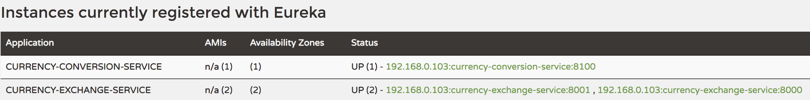

# Netflix zuul API gateway server

### Api gateway
Common features that needs to implemented for all microservices.
* Authentication, authorization and security.
* Rate limiting
* Fault tolerance
* Service aggregation

Instead of calling microservices directly, all the calls will go through API gateway. Api gateway will take care of providing common features as listed above.

### Calling microservices using netflix zuul api gateway

#### Conventional microservice URL

```bash
http://{application_host}:{application_port}/{uri}
```

#### Equivalent URL to execute request via netflix zuul API gateway
```bash
http://{zuul_server_host}:{zuul_server_port}/{application_name}/{uri}
```

for example `http://localhost:8000/currency-exchange/from/USD/to/INR`  is direct microservice URL
where
* `application_host` is `localhost`
* `application_port` is `8000`
* `uri` is `/currency-exchange/from/USD/to/INR`
* `application_name` is `currency-exchange-service` as defined in application.properties file with
property name as `spring.application.name`.

since zuul server is running on localhost:7865 so
* `zuul_server_host` is `loalhost`
* `zuul_server_port` is `8765`

zuul equivalent URL is `http://localhost:8765/currency-exchange-service/currency-exchange/from/USD/to/INR` .

similarly, zuul equivalent endpoint for `http://localhost:8100/currency-converter/from/USD/to/INR/quantity/500` will be
`http://localhost:8765/currency-conversion-service/currency-converter/from/USD/to/INR/quantity/500`.

### Troubleshooting
1. all microservices and zuul api gateway servers are registered and discovered by eureka naming server.
2. make sure application name for each microservice are put correctly.
3. make sure all microservices along with zuul services are visible in eureka naming server.

